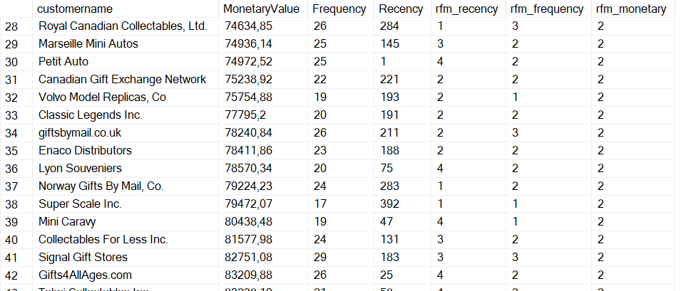
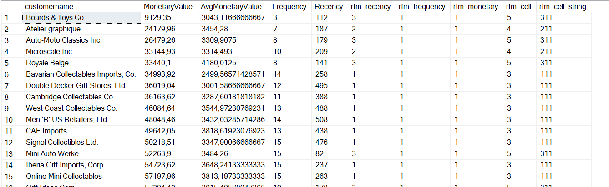
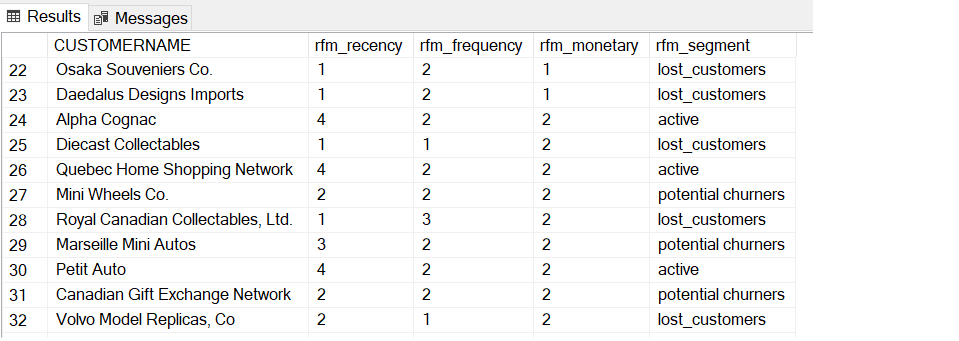

# RFM-Analysis

## Project Overview
RFM Analysis is used to understand and `segment customers` based on their buying behaviour. RFM stands for `Recency`, `Frequency`, and `Monetary` value, which are three key metrics that provide information about customer __engagement__, __loyalty__, and __value__ to a business. 
These segments enables targeted marketing and personalized strategies for each segment.
Three key metrics:
* Recency (R): How recently a customer has made a purchase.
* Frequency (F): How often a customer makes a purchase.
* Monetary Value (M): How much money a customer spends.
## Skills Used
- **Converting Data Types** 
- **CTEs** 
- **Temp Tables** 
- **Windows Functions** 
- **Aggregate Functions** 

# Decoding the RFM Analysis Process  
The final result of this query is a temporary table named #rfm that contains information about each customer's RFM scores and other relevant details.

**How Quartiles Work ?** Quartiles are a statistical tool that divides a dataset into four equal parts. In the context of RFM analysis:
* rfm_recency represents the Recency quartile (1 to 4).
* rfm_frequency represents the Frequency quartile (1 to 4).
* rfm_monetary represents the MonetaryValue quartile (1 to 4).
* 

- **rfm_cell**: 
The composite RFM score for each customer is calculated by adding up their quartile scores for Recency, Frequency, and MonetaryValue. This provides a single numerical value that summarizes the customer's behavior across these three dimensions.

- **rfm_cell_string**: 
The string representation is created by concatenating the individual quartile values for Recency, Frequency, and MonetaryValue.

Finally The customers are categorized into the following segments:
- **Lost Customers:** Customers who were active but not recently.
- **Slipping Away:** Big spenders who haven't made recent purchases.
- **New Customers:** Recently acquired customers.
- **Potential Churners:** Customers showing signs of potential churn.
- **Active:** Customers buying often and recently at low price points.
- **Loyal:** Consistently high RFM scores.
  

# Contacts
For any inquiries or further information, please contact:
- **Name:** Hatim Lazim
- **Email:** hatimlazim.hl@gmail.com
- **LinkedIn:** <a href="https://ma.linkedin.com/in/hatim-lazim" target="_blank">Hatim Lazim</a> 

